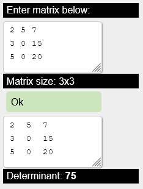

# Matrix determinant calculator

Runtime [matrix determinant](https://en.wikipedia.org/wiki/Determinant) calculator.  
To compute determinant, algorithm recursively computes minors. 

### [>>Click<<](https://alordash.github.io/MatrixDeterminant/publish/wwwroot/) to open in your browser.  

